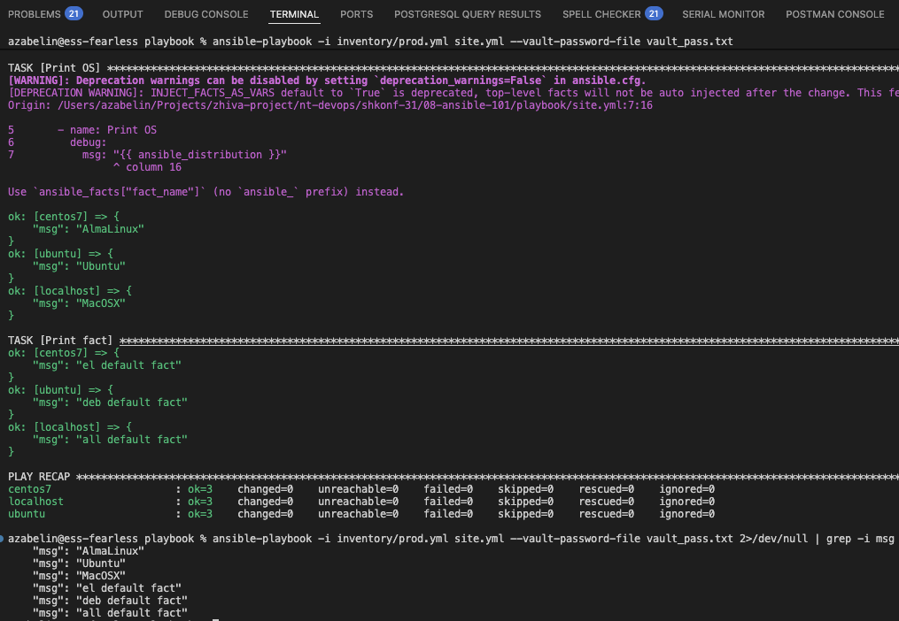

# Lesson 01 - Ansible 101

## Solution

1. Script:

    ```sh
    azabelin@ess-fearless playbook % ansible-playbook -i inventory/test.yml site.yml 2>/dev/null | grep -i msg
        "msg": "MacOSX"
        "msg": 12
    azabelin@ess-fearless playbook % 
    ```

2. Script:

    ```sh
    azabelin@ess-fearless playbook % ansible-playbook -i inventory/test.yml site.yml 2>/dev/null | grep -i msg
        "msg": "MacOSX"
        "msg": "all default fact"
    azabelin@ess-fearless playbook % cat group_vars/all/examp.yml 
    ---
      some_fact: "all default fact"
    ```

3. Commands (CentOS is dead):

    ```sh
    docker run -d --rm --name centos7 almalinux:9 sleep 999999999
        sed -i 's/mirrorlist/#mirrorlist/g' /etc/yum.repos.fr/CentOS-*
        sed -i 's|#baseurl=http://mirror.centos.org|baseurl=http://vault.centos.org|g' /etc/yum.repos.d/CentOS-*

    docker run -d --rm --name ubuntu ubuntu:24.04 sleep 999999999
    ```

4. Script:

    ```sh
    azabelin@ess-fearless playbook % ansible-playbook -i inventory/prod.yml site.yml 2>/dev/null | grep -i msg
        "msg": "AlmaLinux"
        "msg": "Ubuntu"
        "msg": "el"
        "msg": "deb"
    ```

5. Script:

    ```sh
    azabelin@ess-fearless playbook % grep -inre some_fact group_vars
    group_vars/el/examp.yml:2:  some_fact: "el default fact"
    group_vars/all/examp.yml:2:  some_fact: "all default fact"
    group_vars/deb/examp.yml:2:  some_fact: "deb default fact"
    ```

6. Script:

    ```sh
    azabelin@ess-fearless playbook % ansible-playbook -i inventory/prod.yml site.yml 2>/dev/null | grep -i msg
        "msg": "AlmaLinux"
        "msg": "Ubuntu"
        "msg": "el default fact"
        "msg": "deb default fact"
    ```

7. Commands:

    ```sh
    echo "netology" > vault_pass.txt
    ansible-vault encrypt group_vars/deb/examp.yml group_vars/el/examp.yml --vault-password-file vault_pass.txt
    ```

8. Command: `ansible-playbook -i inventory/prod.yml site.yml --vault-password-file vault_pass.txt`

9. Script:

    ```sh
    azabelin@ess-fearless playbook % ansible-doc -t connection -l | grep -i ansible.builtin
    ansible.builtin.local                execute on controller
    ansible.builtin.psrp                 Run tasks over Microsoft PowerShell Re...
    ansible.builtin.ssh                  connect via SSH client binary
    ansible.builtin.winrm                Run tasks over Microsoft's WinRM 
    ```

10. Inventory:

    ```yaml
    ---
        el:
            hosts:
            centos7:
                ansible_connection: docker
        deb:
            hosts:
            ubuntu:
                ansible_connection: docker
        local:
            hosts:
            localhost:
                ansible_connection: ansible.builtin.local
    ```

11. Script:

    ```sh
    azabelin@ess-fearless playbook % ansible-playbook -i inventory/prod.yml site.yml --vault-password-file vault_pass.txt 2>/dev/null | grep -i msg
        "msg": "AlmaLinux"
        "msg": "Ubuntu"
        "msg": "MacOSX"
        "msg": "el default fact"
        "msg": "deb default fact"
        "msg": "all default fact"
    ```

12. Done

13. Screenshot

