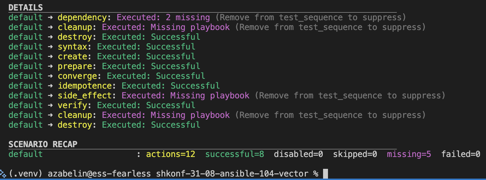
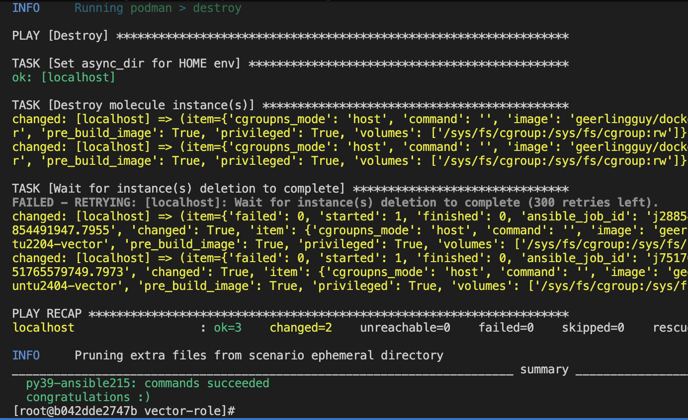

# Lesson 05 - Ansible testing

## Solution

* Link to vector role with tests - https://github.com/AZabelin-GO/shkonf-31-08-ansible-104-vector/blob/4d88e9645d5fb269cfe79288248c2596d6cf7d7e/molecule/default/verify.yml (see tag 0.1.5)

### Molecule

### Tox with molecule and podman

