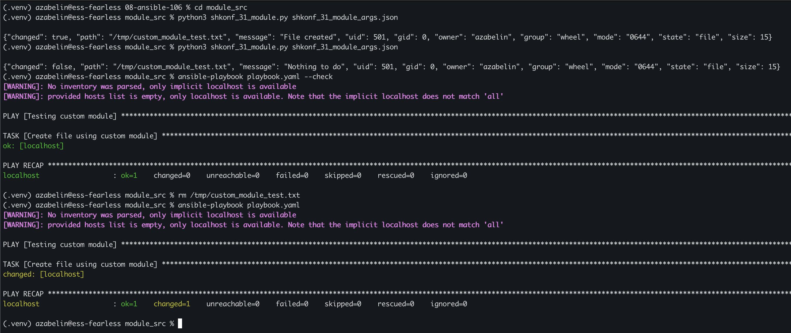
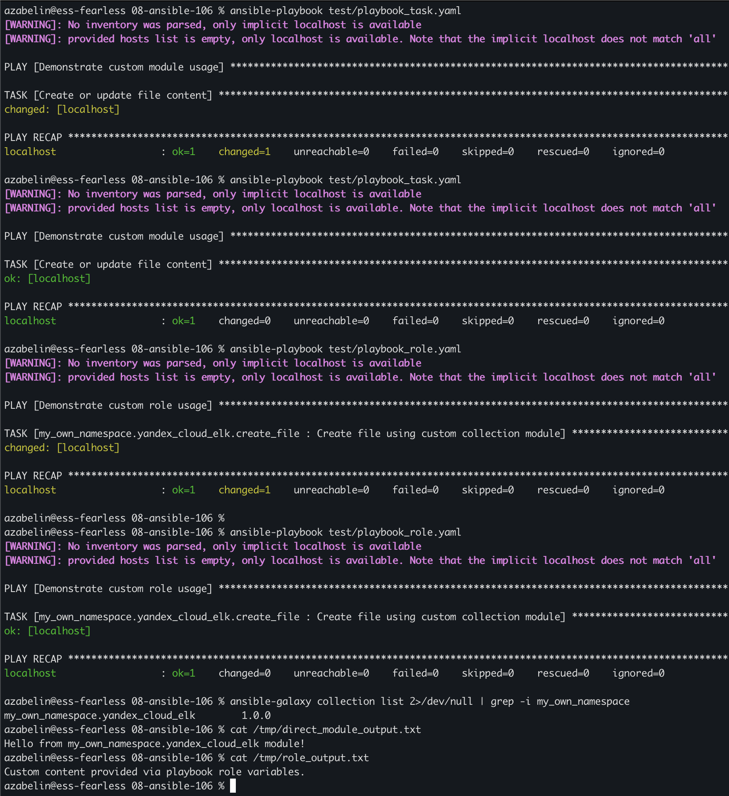

# Lesson 06 - Ansible module

## Precondition

- Python 3.8+
- Ansible Core installed (`pip install ansible`)
- Active Python virtual environment (`.venv`)

## Solution

This directory contains the implementation of a custom Ansible module for file creation with content, packaged into an Ansible Collection along with an abstraction role and verification playbooks.

### Project Structure

```text
08-ansible-106/
├── README.md
├── module_src/                                  # Standalone module sources and local testing
│   ├── ansible.cfg
│   ├── playbook.yaml
│   ├── shkonf_31_module.py                      # Custom Ansible module (Python)
│   └── shkonf_31_module_args.json               # JSON input file for direct testing
├── my_own_namespace/yandex_cloud_elk/           # Ansible Collection source
│   ├── galaxy.yml                               # Collection metadata
│   ├── README.md
│   ├── meta/runtime.yml                         # Runtime Ansible requirements
│   ├── my_own_namespace-yandex_cloud_elk-1.0.0.tar.gz # Built collection package
│   ├── plugins/modules/
│   │   └── shkonf_31_module.py                  # Module within collection
│   └── roles/create_file/                       # Role utilizing the custom module
│       ├── defaults/main.yml
│       └── tasks/main.yml
└── test/                                        # Playbooks for testing installed collection
    ├── playbook_role.yaml                       # Role execution test
    └── playbook_task.yaml                       # Direct execution test
```

### Standalone Custom Module Development (`module_src/`)

The custom module `shkonf_31_module.py` manages target file creation and content synchronization.

**Key Technical Features:**

- **Idempotency**: Reads existing file content and compares it with desired input. Only flags `changed=true` if the file doesn't exist or content differs.
- **Check Mode (`--check`)**: Native support for dry-run mode (`supports_check_mode=True`), returning simulated state without writing to disk.
- **Error Handling**: Captures IO errors and returns descriptive JSON error payloads via `module.fail_json()`.

#### Testing Standalone Module

1. **Direct execution via Python & JSON input:**

   ```bash
   cd module_src
   python3 shkonf_31_module.py shkonf_31_module_args.json
   ```

2. **Execution via local playbook:**

   ```bash
   ansible-playbook playbook.yaml --check
   ansible-playbook playbook.yaml
   ```

### Collection & Role Packaging (`my_own_namespace/yandex_cloud_elk`)

The module is packaged into a collection `my_own_namespace.yandex_cloud_elk`.

1. **Module location**: `plugins/modules/shkonf_31_module.py`
2. **Role implementation**: `roles/create_file`
   - `defaults/main.yml`: Defines default `file_path` and `file_content` variables.
   - `tasks/main.yml`: Executes `my_own_namespace.yandex_cloud_elk.shkonf_31_module`.

#### Building and Installing the Collection

```bash
cd my_own_namespace/yandex_cloud_elk

ansible-galaxy collection build

ansible-galaxy collection install my_own_namespace-yandex_cloud_elk-1.0.0.tar.gz --force
```

---

### Verification & Testing (`test/`)

Verification was performed using test playbooks targeting the installed collection.

#### Test 1: Call from task (`test/playbook_task.yaml`)

```bash
ansible-playbook test/playbook_task.yaml --check
ansible-playbook test/playbook_task.yaml
```

#### Test 2: Call via role (`test/playbook_role.yaml`)

```bash
ansible-playbook test/playbook_role.yaml --check
ansible-playbook test/playbook_role.yaml
```

#### Screenshots




